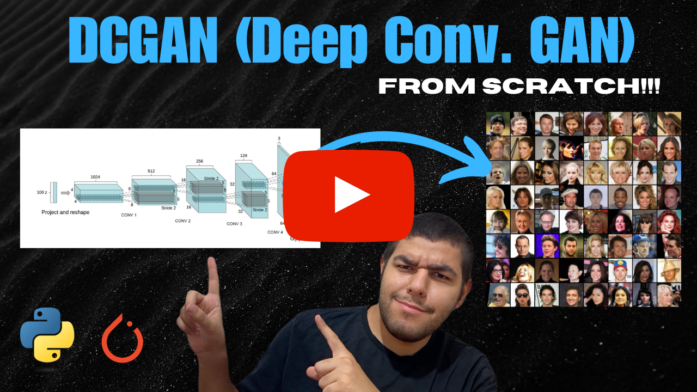

# DCGAN Implementation With PyTorch

<div align="center">
    <a href="">
        
    </a>
</div>
<br/>
<div align="center">
    <p>Liked our work? give us a ⭐!</p>
</div>

<p align="center">
  
</p>

This repository contains unofficial implementation of DCGAN that is introduced in the paper [Unsupervised Representation Learning with Deep Convolutional Generative Adversarial Networks](https://arxiv.org/abs/1511.06434) using PyTorch. Implementation has tested using the [CelebFaces Attributes (CelebA) Dataset](https://www.kaggle.com/datasets/jessicali9530/celeba-dataset) for image generation task.

### YouTube Tutorial
This repository also contains a corresponding YouTube tutorial with the title **Implement and Train DCGAN From Scratch for Image Generation - PyTorch**

[](https://www.youtube.com/watch?v=1zeIBTcmF_s)

## Table of Contents
* [DCGAN Implementation](#dcganimp)
    * [Discriminator](#discriminator)
    * [Generator](#generator)
* [Train Loop](#trainloop)
* [Usage](#usage)
* [Contact](#contact)

## DCGAN Implementation <a class="anchor" id="dcganimp"></a>
We need two classes to implement ViT. First is the `Discriminator` to classify an image as real or fake, second is the `Generator` to generate an image.


### ViT <a class="anchor" id="discriminator">

```
class Discriminator(nn.Module):
    def __init__(self, feature_map_dim, channels):
        super(Discriminator, self).__init__()
        self.conv_1 = nn.Conv2d(channels, feature_map_dim*2, 4, 2, 1, bias=False) #size [128, 32, 32]
        self.conv_2 = nn.Conv2d(feature_map_dim*2, feature_map_dim*4, 4, 2, 1, bias=False) #size [256, 16, 16]
        self.conv_3 = nn.Conv2d(feature_map_dim*4, feature_map_dim*8, 4, 2, 1, bias=False) #size [512, 8, 8]
        self.conv_4 = nn.Conv2d(feature_map_dim*8, feature_map_dim*16, 4, 2, 1, bias=False) #size [1024, 4, 4]
        self.conv_5 = nn.Conv2d(feature_map_dim*16, 1, 4, 1, 0, bias=False) #size [1, 1, 1]

        self.leaky_relu = nn.LeakyReLU(0.2)

        self.batch_norm_1 = nn.BatchNorm2d(feature_map_dim*4)
        self.batch_norm_2 = nn.BatchNorm2d(feature_map_dim*8)
        self.batch_norm_3 = nn.BatchNorm2d(feature_map_dim*16)

        self.sigmoid = nn.Sigmoid()


    def forward(self, inp):
        x = self.conv_1(inp)
        x = self.leaky_relu(x)

        x = self.conv_2(x)
        x = self.batch_norm_1(x)
        x = self.leaky_relu(x)

        x = self.conv_3(x)
        x = self.batch_norm_2(x)
        x = self.leaky_relu(x)

        x = self.conv_4(x)
        x = self.batch_norm_3(x)
        x = self.leaky_relu(x)

        x = self.conv_5(x)
        out = self.sigmoid(x)

        return out
```

### Generator <a class="anchor" id="generator">

```
class Generator(nn.Module):
    def __init__(self, input_vector_dim, feature_map_dim, channels):
        super(Generator, self).__init__()
        self.convt_1 = nn.ConvTranspose2d(input_vector_dim, feature_map_dim*16, 4, 1, 0, bias=False) #size [1024, 4, 4]
        self.convt_2 = nn.ConvTranspose2d(feature_map_dim*16, feature_map_dim*8, 4, 2, 1, bias=False) #size [512, 8, 8]
        self.convt_3 = nn.ConvTranspose2d(feature_map_dim*8, feature_map_dim*4, 4, 2, 1, bias=False) #size [256, 16, 16]
        self.convt_4 = nn.ConvTranspose2d(feature_map_dim*4, feature_map_dim*2, 4, 2, 1, bias=False) #size [128, 32, 32]
        self.convt_5 = nn.ConvTranspose2d(feature_map_dim*2, channels, 4, 2, 1, bias=False) #size [3, 64, 64]

        self.relu = nn.ReLU()

        self.batch_norm_1 = nn.BatchNorm2d(feature_map_dim*16)
        self.batch_norm_2 = nn.BatchNorm2d(feature_map_dim*8)
        self.batch_norm_3 = nn.BatchNorm2d(feature_map_dim*4)
        self.batch_norm_4 = nn.BatchNorm2d(feature_map_dim*2)

        self.tanh = nn.Tanh()

    def forward(self, inp):
        x = self.convt_1(inp)
        x = self.batch_norm_1(x)
        x = self.relu(x)

        x = self.convt_2(x)
        x = self.batch_norm_2(x)
        x = self.relu(x)

        x = self.convt_3(x)
        x = self.batch_norm_3(x)
        x = self.relu(x)

        x = self.convt_4(x)
        x = self.batch_norm_4(x)
        x = self.relu(x)

        x = self.convt_5(x)
        out = self.tanh(x)

        return out
```

## Train Loop <a class="anchor" id="trainloop"></a>

```
criterion = nn.BCELoss()

discriminator_optimizer = optim.Adam(discriminator.parameters(), lr=LR, betas=(BETA1, 0.999))
generator_optimizer = optim.Adam(generator.parameters(), lr=LR, betas=(BETA1, 0.999))

generator.train()
discriminator.train()

start = timeit.default_timer()
for epoch in tqdm(range(EPOCHS), position=0, leave=True):
    generator_running_loss = 0
    discriminator_running_loss = 0
    for idx, data in enumerate(tqdm(dataloader, position=0, leave=True)):
        img_data = data[0].to(device) #size [1024, 3, 64, 64]
        dummy_labels = data[1] #size [1024]
        
        real_labels = torch.full((dummy_labels.size()), 1., dtype=torch.float).to(device) #size [1024]
        fake_labels = torch.full((dummy_labels.size()), 0., dtype=torch.float).to(device)
        noise = torch.randn(dummy_labels.size()[0], INPUT_VECTOR_DIM, 1, 1).to(device) #size [1024, 100, 1, 1]
        
        
        discriminator_real_out = discriminator(img_data).view(-1) #size [1024] .view(-1) to rid unnecessary dimensions
        discriminator_real_loss = criterion(discriminator_real_out, real_labels)
        discriminator.zero_grad()
        discriminator_real_loss.backward()
        
        generator_fake_out = generator(noise) #size [1024, 3, 64, 64]
        discriminator_fake_out = discriminator(generator_fake_out.detach()).view(-1) #detach used because we'll calculate it for a second time
        discriminator_fake_loss = criterion(discriminator_fake_out, fake_labels) 
        discriminator_fake_loss.backward()
        discriminator_running_loss += discriminator_real_loss.item() + discriminator_fake_loss.item()
        discriminator_optimizer.step()

        discriminator_fake_out = discriminator(generator_fake_out).view(-1) #calculated it for a second time. So that we won't have to backward graphs a second time
        generator_loss = criterion(discriminator_fake_out, real_labels)
        generator_running_loss += generator_loss.item()
        generator.zero_grad()
        generator_loss.backward()
        generator_optimizer.step()
        
    
    discriminator_loss = discriminator_running_loss / 2*(idx + 1)
    generator_loss = generator_running_loss / (idx + 1)
    
    print(f"Discriminator Loss EPOCH {epoch+1}: {discriminator_loss:.4f}")
    print(f"Generator Loss EPOCH {epoch+1}: {generator_loss:.4f}")
    plt.figure(figsize=(10,10))
    plt.subplot(1,2,1)
    plt.axis("off")
    plt.title(f"Epoch {epoch+1} Generated Images")
    plt.imshow(np.transpose(vutils.make_grid(generator_fake_out[:9], padding=5, normalize=True, nrow=3).cpu(),(1,2,0)))
    plt.show()
    
stop = timeit.default_timer()
print(f"Training Time: {stop-start:.2f}s")
```

## Usage <a class="anchor" id="usage"></a>

You can run the code by downloading the notebook and updating the variable `data_dir` to point a valid dataset location.

## Contact <a class="anchor" id="contact"></a>
You can contact me with this email address: uygarsci@gmail.com
